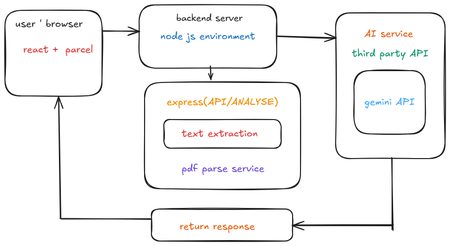

 ClauseWise: Your AI Legal Assistant
ClauseWise is a sophisticated full-stack web application designed to bridge the gap between complex legal jargon and everyday understanding. By simply uploading a PDF document, users can leverage the analytical power of Large Language Models (LLMs) to automatically identify, extract, and receive plain-language explanations of the most critical clauses.



This project serves as a powerful demonstration of integrating modern AI services into a practical, user-centric tool, making legal information more transparent and accessible to all.

FEW SCREENSHOTS OF WEBSITE--


Core Features
1.Effortless Document Upload: A clean, intuitive drag-and-drop interface for seamless PDF file uploads.

2.Intelligent AI Analysis: Utilizes the Google Gemini or OpenAI API to perform deep contextual analysis of the legal text.

3.Critical Clause Extraction: The AI is meticulously prompted to find and isolate key legal sections such as Liability, Termination, Confidentiality, Governing Law, Indemnification, and more.

4.Jargon-Free Explanations: Every extracted clause is accompanied by a simple, concise explanation, as if a lawyer were explaining it to a client.

5.Modern & Responsive UI: A beautifully designed interface built with React and Tailwind CSS, ensuring a flawless user experience on desktop and mobile devices.

6.Technology Stack
This project is built with a modern, robust, and scalable technology stack, chosen for performance and developer experience.

Frontend
1.React: The core of our user interface, enabling the creation of dynamic, stateful components.

2.Parcel: A blazingly fast, zero-configuration web application bundler that simplifies the development workflow.

3.Tailwind CSS: A utility-first CSS framework that allows for rapid, custom UI design without leaving the HTML.

Backend
1.Node.js: A JavaScript runtime environment that allows us to run JavaScript on the server, enabling a unified language across the stack.

2.Express.js: A minimal and flexible Node.js framework that provides a robust set of features for building our backend API.

3.PDF-Parse: A powerful Node.js library used to extract raw text content from PDF files on the server.

4.Multer: A Node.js middleware for handling multipart/form-data, used for processing file uploads.

AI & API---
Google Gemini API / OpenAI API: The AI engine that performs the core text analysis. The backend is architected to be compatible with either service.

 How It Works
The application follows a logical and secure data flow from the client to the server, to the AI, and back again.

1.File Upload (Client-Side):

*The user selects or drags-and-drops a PDF file into the React application.

*An onChange event handler captures the file object. The app stores the file in its state and displays the file name to the user.

2.API Request (Client to Server):

*Upon clicking "Analyze Document," the handleSubmit function is triggered.

*A FormData object is created, and the selected file is appended to it. FormData is the standard method for sending files over HTTP.

*A fetch request is made to the backend's /api/analyze endpoint, with the FormData as the request body.

3.Backend Processing (Server-Side):

*The Express server receives the POST request. The Multer middleware intercepts the request, parses the multipart/form-data, and makes the uploaded file available in memory as a buffer (req.file.buffer).

*The PDF-Parse library reads this buffer and extracts the complete text content of the PDF into a single string.

4.AI Analysis (Server to AI API):

*The extracted text is embedded into a carefully engineered prompt. This prompt instructs the AI model (e.g., Gemini 1.5 Flash) on its role, the exact task to perform, and the precise JSON structure to return.

*An HTTPS request is sent to the AI provider's API endpoint, containing the prompt and the API key (securely loaded from a .env file).

5.Response Handling (AI to Server):

*The AI API processes the request and sends back a response. The core content is a JSON object wrapped in a string.

*The backend server receives this response. It performs robust parsing by first extracting the JSON string from any potential markdown formatting (e.g., json ... ) and then using JSON.parse() to convert it into a JavaScript object.

6.Data Transmission (Server to Client):

*The server sends the final, clean array of clause objects back to the React client with a 200 OK status.

*If any step fails, a catch block on the server sends a 500 Internal Server Error status with a descriptive error message.

7.Displaying Results (Client-Side):

*The React app's try...catch block handles the response from the server.

*On success, the received array of clauses is stored in the React state.

*React's rendering logic maps over this array, displaying each clause and its explanation in a styled <ClauseCard> component. The UI updates automatically to show the results.

--Setup and Installation
To get this project running locally, follow these steps:

Prerequisites
Node.js (LTS version recommended)

An API key from Google AI Studio (Gemini) or OpenAI Platform.

1. Backend Setup

```
# Navigate to the backend folder
cd clause-detector-backend

# Install all required npm packages
npm install

# Create the environment variables file
# In Windows Powershell: New-Item .env
# In MacOS/Linux or Git Bash: touch .env
touch .env

# Start the server
node server.js
```

Your backend server will start on http://localhost:8888.

2. Frontend Setup

```
Open a new terminal window for the frontend.

# Navigate to the frontend folder
cd legal-analyzer-frontend-parcel

# Install all required npm packages
npm install

# Start the Parcel development server
npm run dev
```
Your frontend application will start, typically on http://localhost:1234. Open this URL in your browser to use the app.

Environment Variables
You must create a .env file in the clause-detector-backend folder.  Add the relevant line for the service you are using:
```
# For Google Gemini
GEMINI_API_KEY=YOUR_SECRET_API_KEY_HERE

# For OpenAI
# OPENAI_API_KEY=YOUR_SECRET_API_KEY_HERE
```
Important: The server only reads the .env file on startup. You must restart the backend server (node server.js) after making any changes to this file.